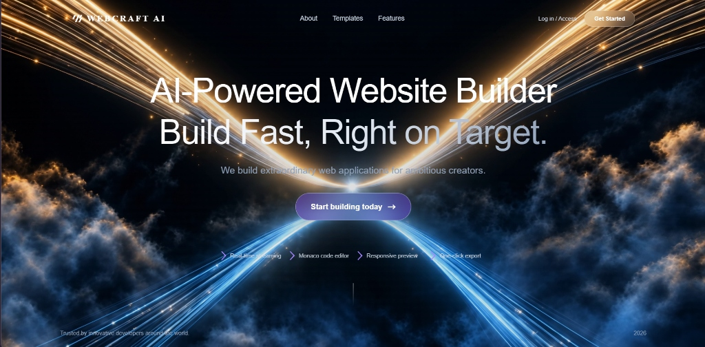
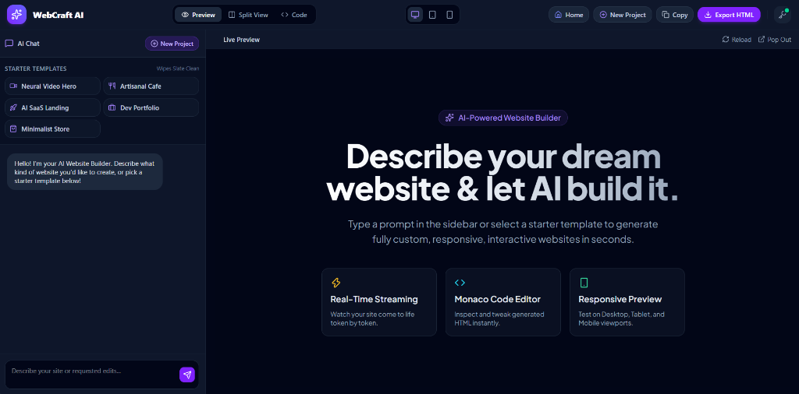
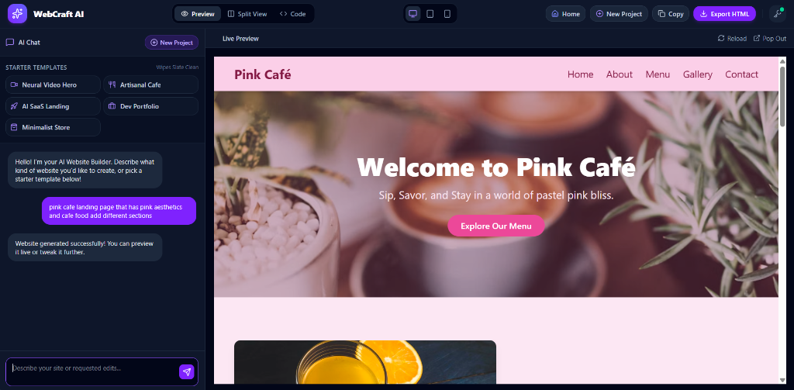

# WebCraft AI — Instant AI Website Builder

WebCraft AI turns natural-language prompts into complete, interactive, single-file HTML / JS / Tailwind web pages in real time. Describe a site in chat, watch it stream into a live preview, then refine it with follow-up prompts or by editing the code directly.

**Demo video:** [Watch on Loom](https://www.loom.com/share/e9ca2c3cfde54c7e815169b33c0ad8af)







Built with React 19, Vite 8, Tailwind CSS v4, Zustand, and the Monaco Editor. AI calls use the OpenAI SDK pointed at the Groq API.

## ✨ Key Features

- ⚡ **Real-time streaming generation:** the page builds live as tokens stream in (preview updates are debounced at 400 ms to avoid flicker).
- 🎨 **Dynamic colour and theme engine:** light, dark, pastel, vibrant, neon, luxury, or any custom palette requested in the prompt.
- 🖼️ **Context-aware Unsplash photos:** topic-matched images per section, with an automatic gradient placeholder for missing or broken URLs.
- 📱 **Responsive viewport controls:** switch between Desktop, Tablet (768 px) and Mobile (375 px) preview frames.
- 💻 **Monaco code editor:** live, two-way editing with instant preview sync.
- 🧩 **Inline sections instead of modals:** contact forms, pricing tables, reservation forms and cart views are embedded as page sections.
- 🔄 **Anchor link handling and smooth scroll:** in-page links (`#menu`, `#pricing`, `#contact`) scroll smoothly inside the preview instead of navigating away.
- 📥 **One-click export:** copy the single-file HTML or download `website.html` directly (with a confetti celebration).

## 💡 Example Prompts

- *"A landing page for a specialty coffee shop with a menu section and a reservation form"*
- *"Dark-mode portfolio for a frontend developer with projects, skills and a contact form"*
- *"Pastel pink and lilac website for a hair salon with pricing and a booking section"*

## 🛠️ Tech Stack

| Area | Technology |
|---|---|
| **Frontend** | React 19, Vite 8, Tailwind CSS v4 (`@tailwindcss/vite`), Zustand v5 |
| **Code editor** | `@monaco-editor/react` |
| **Icons** | Lucide React |
| **AI** | `openai` SDK configured for Groq API streaming |
| **Injected into generated pages** | Tailwind CSS CDN, Alpine.js v3, Lucide Icons |

## 🚀 Quick Start

**Prerequisites:** Node.js 20.19+ or 22.12+ (required by Vite 8) and npm. You also need a free Groq API key from the [Groq Console](https://console.groq.com/).

### 1. Clone and install
```bash
git clone https://github.com/Areebakn26/mini-website-builder.git
cd mini-website-builder
npm install
```

### 2. Configure environment variables
Create a `.env.local` file in the project root (see `.env.example`):
```env
VITE_AI_API_KEY=your_groq_api_key_here
VITE_AI_BASE_URL=https://api.groq.com/openai/v1
VITE_AI_MODEL=openai/gpt-oss-120b
```

### 3. Run the development server
```bash
npm run dev
```
Open [http://localhost:5173](http://localhost:5173) in your browser.

## 📦 Production Build
```bash
npm run build
npm run preview
```

## 🏗️ Project Structure
```
mini-website-builder/
├── docs/               # Screenshots and media assets
├── public/             # Static assets and icons
├── src/
│   ├── components/     # Navbar, ChatSidebar, PreviewIframe, CodeEditor, LandingPage, ApiKeyModal
│   ├── services/       # AI streaming engine (grok.js), HTML extraction
│   ├── store/          # Zustand global state (useBuilderStore.js)
│   ├── App.jsx         # Workspace router and layout grid
│   ├── main.jsx        # React root
│   └── index.css       # Tailwind imports and scrollbar styles
├── .env.example        # Environment template
├── index.html          # Document shell
├── package.json        # Dependency manifest
└── vite.config.js      # Vite build configuration
```

## 🔒 Security Notes
- The preview runs in an `<iframe sandbox="allow-scripts allow-modals">` (no `allow-same-origin`), so generated code cannot read the parent page's `localStorage` or the stored API key.
- `.env.local` is git-ignored; only `.env.example` is committed.

## ⚠️ Known Limitations
- **Client-side API key:** the key is supplied through a `VITE_` variable, so it is bundled into the browser build. This is fine for a local demo; a production version should proxy requests through a small backend.
- **Edit context limit:** the current HTML is truncated to 8,000 characters when sent back to the model, so very large pages may lose detail in later sections during iterative edits.
- **CDN-dependent preview:** generated pages load Tailwind, Alpine.js and Lucide from CDNs, so the preview needs an internet connection.

## 📄 License
MIT License
